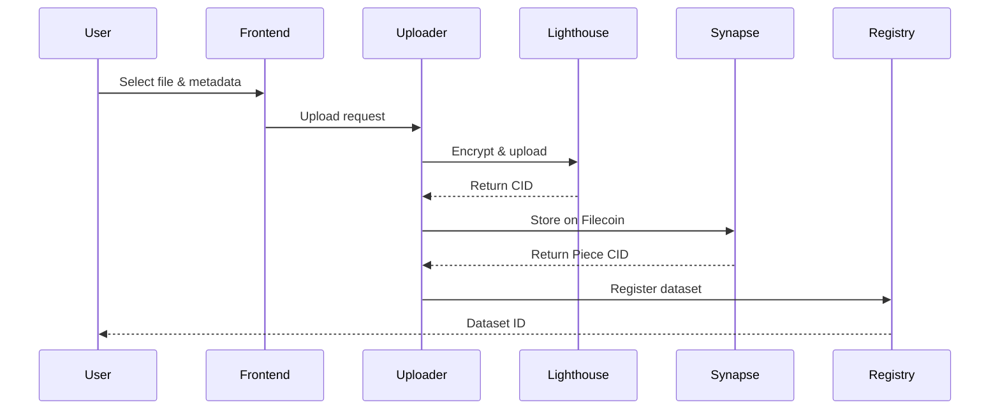
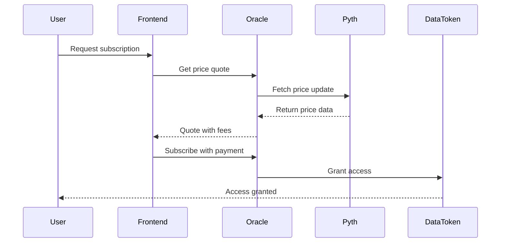
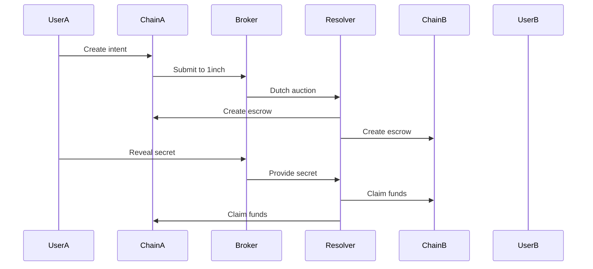

# 🏗️ Architecture Documentation

## System Overview

The ZK Cross-Chain Data Marketplace is a decentralized platform that enables secure, privacy-preserving data exchange across blockchain networks. The system combines zero-knowledge identity verification, encrypted storage, dynamic pricing, and cross-chain atomic swaps.

## Core Components

### 1. Smart Contract Layer

#### DataToken1155
- **Purpose**: Represents access rights to datasets using ERC-1155 standard
- **Key Features**:
  - Self Protocol integration for zk identity verification
  - EIP-712 permit functionality for gasless approvals
  - Lighthouse custom contract compatibility
  - UUPS upgradeable pattern

#### PricingOracleAdapter
- **Purpose**: Integrates Pyth price feeds for dynamic dataset pricing
- **Key Features**:
  - Real-time price updates with staleness protection
  - Circuit breaker mechanisms for price anomalies
  - Subscription management and renewal
  - Gas-optimized update mechanisms

#### RNGCoordinator
- **Purpose**: Provides verifiable randomness using Pyth Entropy
- **Key Features**:
  - Fair lottery systems for premium dataset access
  - Prize pool management
  - Request cooldowns and rate limiting
  - Transparent random number generation

#### CrossChainEscrow
- **Purpose**: Enables atomic swaps across different blockchains
- **Key Features**:
  - HTLC (Hash Time Lock Contract) implementation
  - 1inch Fusion+ compatibility
  - Multi-asset support (ETH and ERC-20)
  - Resolver authorization and bonding

#### DatasetRegistry
- **Purpose**: Central registry for dataset metadata and PDP status
- **Key Features**:
  - Filecoin CID storage (Lighthouse and Synapse)
  - Proof of Data Possession (PDP) tracking
  - Owner and curator management
  - Batch operations for efficiency

### 2. Off-Chain Services

#### Uploader Service
- **Technology**: Node.js/TypeScript
- **Responsibilities**:
  - Encrypt and upload files to Lighthouse
  - Store data on Filecoin via Synapse SDK
  - Register datasets on-chain
  - Apply access control conditions

#### Price Relayer
- **Technology**: Node.js/TypeScript + Pyth SDK
- **Responsibilities**:
  - Monitor Pyth Hermes for price updates
  - Submit price updates to on-chain contracts
  - Handle staleness detection and circuit breakers
  - WebSocket connection management

#### RNG Coordinator Service
- **Technology**: Node.js/TypeScript
- **Responsibilities**:
  - Manage Pyth Entropy requests
  - Handle callback processing
  - Monitor lottery states
  - Prize distribution logic

#### Settlement Broker
- **Technology**: Node.js/TypeScript + 1inch API
- **Responsibilities**:
  - Process cross-chain swap intents
  - Interact with 1inch Fusion+ resolvers
  - Manage HTLC lifecycle
  - Handle Citrea BTC settlements

### 3. Frontend Application

#### Technology Stack
- **Framework**: Next.js 14 with App Router
- **Styling**: Tailwind CSS
- **Web3**: Wagmi + RainbowKit
- **State Management**: React hooks + TanStack Query

#### Key Pages
- Dataset browser and subscription management
- Price oracle dashboard
- RNG lottery interface
- Cross-chain bridge
- User profile and zk identity management

## Data Flow

### Dataset Upload Flow

### Subscription Flow

### Cross-Chain Swap Flow

## Security Model

### Identity Verification
- Self Protocol provides zero-knowledge proof of humanity
- No personal data stored on-chain
- Scope-based proof replay prevention
- Configurable verification requirements (age, nationality, OFAC)

### Access Control
- Role-based permissions using OpenZeppelin AccessControl
- UUPS upgradeable pattern with Governor timelock
- Circuit breakers for price anomalies
- Emergency pause functionality

### Cross-Chain Security
- HTLC ensures atomic swaps
- Resolver bonding and authorization
- Timelock-based refund mechanisms
- Replay protection via EIP-712 nonces

## Integration Points

### External Services

#### Pyth Network
- **Price Feeds**: Real-time asset prices with sub-second latency
- **Entropy**: Verifiable random number generation
- **Integration**: Pull-based oracle updates with fee mechanism

#### Self Protocol
- **Identity**: Zero-knowledge proof of government ID
- **Privacy**: Selective disclosure of attributes
- **Integration**: On-chain verification with callback pattern

#### Lighthouse Storage
- **Encryption**: Client-side AES encryption
- **Access Control**: Token-gated and custom contract conditions
- **Integration**: SDK-based upload and retrieval

#### Filecoin/Synapse
- **Storage**: Decentralized, verifiable data storage
- **PDP**: Proof of Data Possession for availability
- **Integration**: SDK-based upload with payment rails

#### 1inch Fusion+
- **Swaps**: Intent-based cross-chain atomic swaps
- **Resolvers**: Professional market makers
- **Integration**: HTLC-compatible escrow contracts

## Deployment Architecture

### Development Environment
- Local Anvil blockchain
- Mock contracts for external services
- Hot reloading for frontend and services
- Comprehensive test suite

### Testnet Environment
- Base Sepolia for EVM contracts
- Real external service integrations
- Staged deployment pipeline
- End-to-end testing

### Production Environment
- Multi-chain deployment (Base, Arbitrum)
- Multi-sig governance
- Monitoring and alerting
- Backup and disaster recovery

## Performance Considerations

### On-Chain Optimization
- Gas-optimized contract design
- Batch operations where possible
- Efficient storage layouts
- Minimal external calls

### Off-Chain Efficiency
- Connection pooling and reuse
- Caching of frequent queries
- Async processing pipelines
- Error handling and retries

### Frontend Performance
- Code splitting and lazy loading
- Optimistic UI updates
- Background data fetching
- Responsive design patterns

## Monitoring and Observability

### Metrics
- Contract interaction rates
- Price update latency
- Error rates and types
- User engagement metrics

### Alerting
- Circuit breaker activations
- Stale price data
- Failed cross-chain swaps
- Service downtime

### Logging
- Structured JSON logging
- Correlation IDs across services
- Debug mode for development
- Log retention policies

This architecture enables a secure, scalable, and user-friendly data marketplace that leverages the best of Web3 infrastructure while maintaining privacy and decentralization principles.
